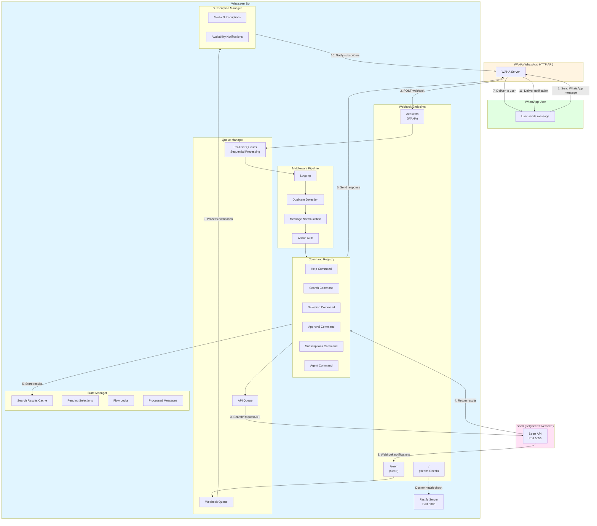

<div align="center">
  

  # Whatseerr

  WhatsApp bot for Seerr that allows users to search and request movies/TV shows via WhatsApp messages.
</div>

## Features

- 🔍 Search movies and TV shows from WhatsApp
- 📺 Request media directly via chat messages
- 🔔 Receive webhook notifications from Seerr
- 👥 User mapping (WhatsApp phone numbers to Seerr user IDs)
- ⚡ Rate limiting and message queuing
- 🎯 Support for 4K requests (optional)

## Architecture

Whatseerr acts as a bridge between WhatsApp (via WAHA) and Seerr, enabling users to search and request media through WhatsApp messages.



### Flow Descriptions

**1. User Request Flow (Search and Request)**:
- User sends WhatsApp message (e.g., `r The Matrix`)
- WAHA receives message and posts to `/requests` webhook
- Message enters per-user queue (prevents race conditions)
- Middleware pipeline processes message (logging, duplicate detection, normalization, admin auth)
- Command registry matches and executes search command
- Search results fetched from Seerr API and stored in cache
- Response sent back to user via WAHA

**2. Selection Flow (Choosing from Results)**:
- User replies with number (e.g., `1`)
- Selection retrieved from search results cache
- Request submitted to Seerr API with user's ID
- Confirmation sent to user
- Cache cleared after successful request

**3. Admin Approval Flow (React to Approve/Decline)**:
- Seerr sends `MEDIA_PENDING` notification to admin
- Admin reacts with ✅ (approve) or ❌ (decline) emoji
- Reaction webhook triggers approval command
- Admin auth middleware validates permissions
- Request approved/declined via Seerr API
- User receives notification of decision

**4. Notification Flow (Seerr Webhooks)**:
- Seerr sends webhook to `/seerr` endpoint (e.g., `MEDIA_APPROVED`, `MEDIA_AVAILABLE`)
- Notification processed by webhook queue
- Subscribers notified via subscription manager
- Users receive WhatsApp message with status update

## Quick Start (Docker - Recommended)

### Prerequisites

- [WAHA](https://github.com/devlikeapro/waha) (WhatsApp HTTP API) running and configured
- Seerr instance
- Docker installed

### 1. Pull the Image and Run

```bash
docker pull ghcr.io/sufxgit/whatseerr:latest
```

#### Environment Variables

| Variable | Description | Required | Default |
|----------|-------------|----------|---------|
| `TZ` | Timezone (e.g., `Asia/Kuwait`, `America/New_York`) | No | `UTC` |

#### Docker Compose Example

```yaml
services:
  whatseerr:
    image: ghcr.io/sufxgit/whatseerr:latest
    container_name: whatseerr-bot
    restart: unless-stopped
    ports:
      - "3006:3006"
    volumes:
      - /path/to/config:/config
    environment:
      - TZ=Asia/Kuwait
```

**Configuration Notes:**
- On first run, a `config.example.json` will be created in your config directory
- Rename it to `config.json` and update with your settings:
  - `host`: The hostname/IP where Seerr, WAHA, and the bot can reach each other
  - `jellyseerr.apiKey`: Get from Seerr → Settings → General
  - `waha.apiKey`: Your WAHA API key
  - `userIdMappings`: Map WhatsApp phone numbers (without @c.us) to Seerr user IDs
    ```json
    "1234567890": {
      "userId": 1,
      "username": ""
    }
    ```
    - `"1234567890"`: WhatsApp phone number including country code (without @c.us suffix)
    - `userId`: The user ID from your Seerr instance - each user has their own unique ID (found in Seerr → Users)
    - `username`: Optional custom display name (leave empty to use Seerr username)

**Unraid:**
- Repository: `ghcr.io/sufxgit/whatseerr:latest`
- Port: `3006:3006` (TCP)
- Volume: `/mnt/user/appdata/whatseerr/config` → `/config` (Read/Write)
- Variable: `TZ=Your/Timezone`

### 2. Configure WAHA Webhook

Point your WAHA session webhook to:
```
http://YOUR_HOST_IP:3006/requests
```

Enable these events:
- `session.status`
- `message`
- `message.reactions`

### 3. Configure Seerr Webhook (Optional)

For receiving notifications (approved/available/declined), add webhook in Seerr:

**Webhook URL:**
```
http://YOUR_HOST_IP:3006/seerr
```

**Types:** Select notification types you want to receive

## Usage

Send a WhatsApp message to your WAHA-connected number:

```
r The Matrix
```

The bot will:
1. Search Seerr for "The Matrix"
2. Return numbered results
3. Wait for you to reply with a number (e.g., "1")
4. Submit the request to Seerr

**Available Commands:**
- `r <title>` or `request <title>` - Search and request media
- `r4k <title>` or `request4k <title>` - Request in 4K quality (if enabled)

## Configuration Options

### System
- `protocol`: `http` or `https`
- `host`: Shared hostname/IP for all services
- `logging.level`: `info` or `debug`

### Services
- `jellyseerr.port`: Seerr port (default: 5055)
- `jellyseerr.apiKey`: Your Seerr API key
- `jellyseerr.defaultUserId`: Default user ID for requests
- `waha.port`: WAHA port (default: 8584)
- `waha.apiKey`: WAHA API key
- `waha.session`: WAHA session name (default: "default")

### Webhooks
- `webhook.requests.path`: Path for WAHA webhook (default: `/requests`)
- `webhook.requests.port`: Webhook server port (default: 3006)
- `webhook.seerr.path`: Path for Seerr webhook (default: `/seerr`)

### Mappings
- `userIdMappings`: Map phone numbers to Seerr user IDs
- `emailMappings`: Auto-populated from webhook notifications
- `lidMappings`: Auto-populated for WhatsApp LID format support

### Commands
- `command`: Comma-separated list of request command aliases
- `command4k`: Comma-separated list of 4K request command aliases
- `help4k`: Show 4K commands in help message (default: false)

## Viewing Logs

```bash
docker logs -f whatseerr-bot
```

## Building from Source

```bash
git clone https://github.com/sufxgit/whatseerr.git
cd whatseerr
docker build -t whatseerr .
```

## Development

For local development without Docker:

1. **Clone the repository**
   ```bash
   git clone https://github.com/sufxgit/whatseerr.git
   cd whatseerr
   ```

2. **Install dependencies**
   ```bash
   npm install
   ```

3. **Create config**
   ```bash
   cp config/config.example.json config/config.json
   nano config/config.json
   ```

4. **Run the bot**
   ```bash
   npm run bot
   ```

## License

MIT
